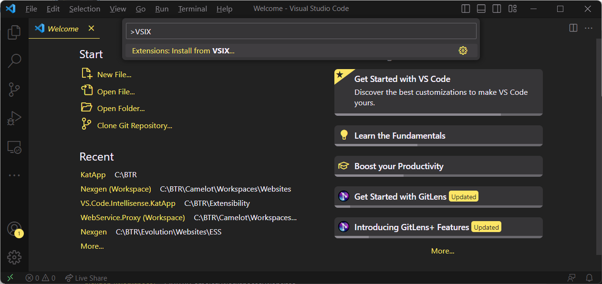

# KAT Test Explorer

A VS Code extension for C# test discovery and execution using the VS Code Testing API. Discovers xUnit tests via Roslyn/MSBuildWorkspace, runs and debugs via `dotnet test`, and reports per-file code coverage directly in the editor.

## Requirements

- .NET 8 SDK or later
- VS Code 1.88.0 or later
- [C# extension](https://marketplace.visualstudio.com/items?itemName=ms-dotnettools.csharp) (installed automatically as a dependency)

## Getting Started

1. [Download the extension](https://github.com/terryaney/Extensibility.VS.Code.Test.Explorer/raw/main/dist/kat-test-explorer-1.0.6.vsix).
1. Press `Ctrl+Shift+P` to open the VS Code command palette. Type `VSIX` and select **Extensions: Install from VSIX...**.

3. Browse to the downloaded `kat-test-explorer-1.0.6.vsix` file and select it.
4. Close and reopen VS Code — the extension activates automatically for any workspace containing a `.csproj` or `.sln` file.
5. Open the **Testing** pane (`Ctrl+Shift+T` or the flask icon in the Activity Bar) to see your discovered tests.

Install [previous versions](#previous-versions) of the extension if needed.

## Features

1. **Automatic Test Discovery** — Discovers xUnit v2 and v3 tests across all C# projects in your solution or workspace using Roslyn/MSBuildWorkspace. No configuration required.

<!-- screenshot: Testing Explorer tree with discovered tests -->

2. **Run Tests from Anywhere** — Run tests from the Testing Explorer tree, directly from the editor gutter next to each test method, or via the command palette.

<!-- screenshot: Gutter run/debug icons next to test methods -->

3. **Debug Support** — Debug tests with full breakpoint support. xUnit v2 uses VSTest host attach. xUnit v3 uses the test project's executable with `-waitForDebugger` for project, class, and method selections, and automatically falls back to VSTest for namespace selections and explicit theory-case selections when that is the only precise routing option.

<!-- screenshot: Debug session hitting a breakpoint in a test -->

4. **Real-time Results** — Test output streams to the Test Results pane as tests execute. Pass, fail, and skip status appear inline with stack traces for failures.

<!-- screenshot: Test Results pane with pass/fail output -->

5. **Code Coverage** — Run tests with coverage to get per-file and per-line coverage overlaid directly in the editor via Coverlet. Coverage results persist between sessions and can be restored after reopening VS Code.

<!-- screenshot: Editor with line coverage highlights -->

6. **Go To Test** — Jump from any test in the Testing Explorer tree straight to the test method in source code using the **Go To Test** inline action.

<!-- screenshot: Go To Test context action in the testing tree -->

7. **Diagnostic Nodes** — When a project fails to load or requires attention, a diagnostic node appears in the test tree with an inline action to view the full error details or get help.

## Known Issues

1. Only xUnit `[Fact]` and `[Theory]` test methods are discovered. MSTest and NUnit projects will appear in the Testing tree (they are recognized as test projects) but their test methods will not be found — you'll see a "No tests discovered" node. Adding xUnit attributes to those projects is necessary for discovery to work.
1. Test discovery depends on MSBuildWorkspace loading successfully. Projects that fail to load (unusual SDK targets, unrestored NuGet packages) are silently skipped — they simply disappear from the tree with no diagnostic. A load error node only appears at the root level if the entire discovery process throws.
1. Code coverage requires [Coverlet](https://github.com/coverlet-coverage/coverlet) (`coverlet.msbuild` package) to be referenced in the test project. The extension uses MSBuild instrumentation (`/p:CollectCoverage=true`) — `coverlet.collector` is not used and not required.

## Previous Versions

1. [1.0.5](https://github.com/terryaney/Extensibility.VS.Code.Test.Explorer/raw/main/dist/kat-test-explorer-1.0.5.vsix)
1. [1.0.4](https://github.com/terryaney/Extensibility.VS.Code.Test.Explorer/raw/main/dist/kat-test-explorer-1.0.4.vsix)
1. [1.0.3](https://github.com/terryaney/Extensibility.VS.Code.Test.Explorer/raw/main/dist/kat-test-explorer-1.0.3.vsix)
1. [1.0.2](https://github.com/terryaney/Extensibility.VS.Code.Test.Explorer/raw/main/dist/kat-test-explorer-1.0.2.vsix)
1. [1.0.1](https://github.com/terryaney/Extensibility.VS.Code.Test.Explorer/raw/main/dist/kat-test-explorer-1.0.1.vsix)
1. [1.0.0](https://github.com/terryaney/Extensibility.VS.Code.Test.Explorer/raw/main/dist/kat-test-explorer-1.0.0.vsix)
